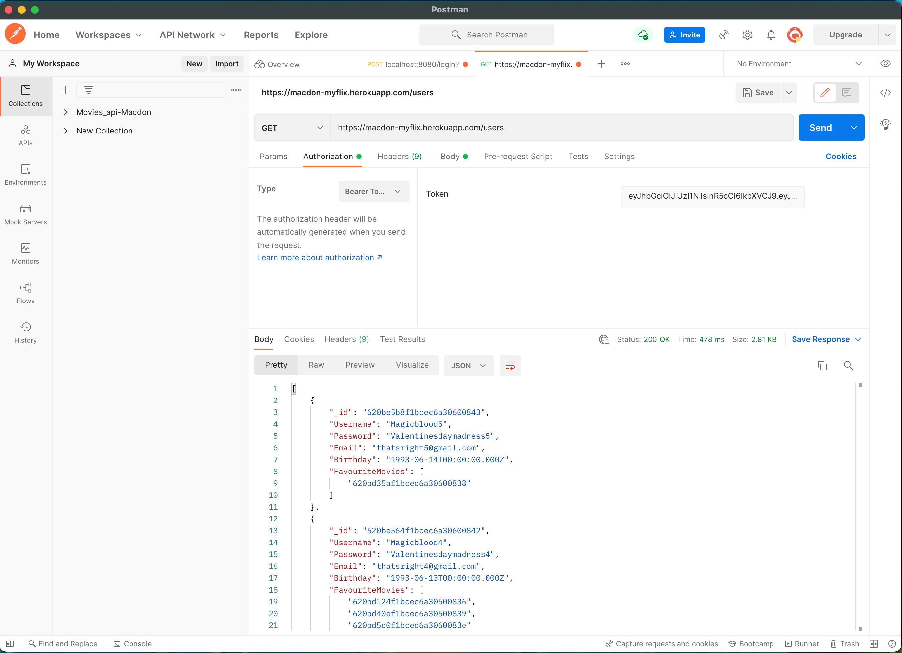
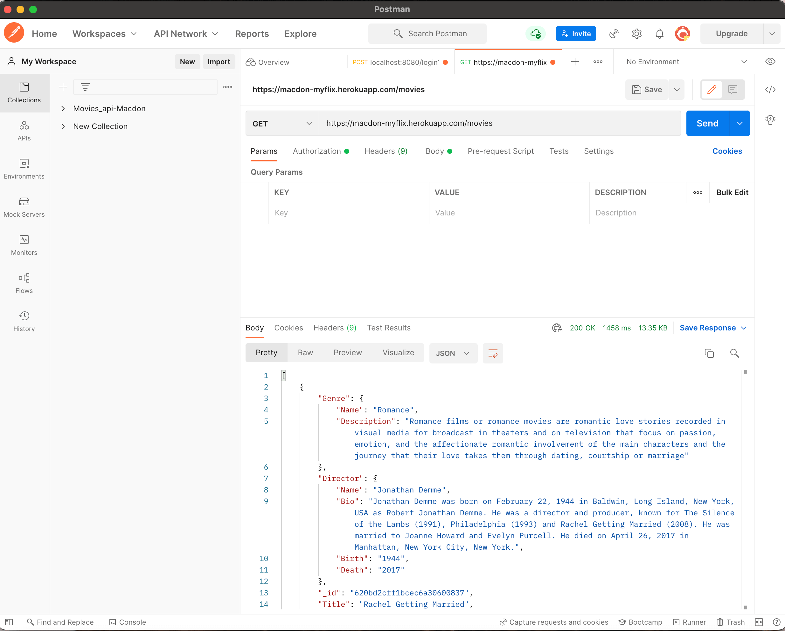

# MyFlix Movie Api

## Description:
<p> As part of my CareerFoundry Full-Stack Web Dev program, I developed a movie API that gives the user access to information about movies. It includes infromation mainly about the movie's description, genre, directors and actors. In order to access this information, you would have to **create a user account (register) and login**. </p>

## Tools and Technogy used: 

(myFlix Api was build with the following tools):
+ Node.js
+ JavaScript
+ Express
+ MongoDB

This API allows a users to access a database to containing data on a diverse genre of movies. The Data provides the user access to information about the movies' synopsis (description), directors and genre specifications. The user will be able to sign up/sign in, update personal information and save/delete favourite movies to/from their user account.

## How to get Started and run the project ...

### As a developer:
1. Clone or download repository ...
```
git clone https://github.com/jessinmacdon/movie_api.git
```
2. Install packages mentioned in the package.json file
```
npm i
```

3. Install mongodb
```
npm install mongodb
```

4. Connect with own MongoDB (local or external)
define CONNECTION_URI as environment variable, otherwise it will connect to mongodb://localhost:27017/test


5. Run/launch server
```
npm run start
```
OR
```
node index.js
```

### As a user:
As a user head one of the clients of the movie api listed below to interact with the movie api and follow these steps:
- To get started, you will need to create an account - use the sign up/register/create an acoount button.
- Second, you will requested to login - please use the credentials you just created to login. A token will be generated and used to log you in to the application where you will see all the movies
```
https://jessinmacdon.github.io/myFlix-App/welcome
```
```
https://jessinmacdon.github.io/movie_api/
```

***You could also test the API using `postman`***


+ Run it using the command below

`$ node index.js`

## Features/Technical Requirements (following the CareerFoundry project brief)

* MongoDB
* node.js, usage of package.json
* Express
* RESTful architecture
* usage of at least three middleware modules
* database: built with MongoDB
* business logic layer: modeled with Mongoose
* API return movies in JSON
* no code-errors
* testing in Postman
* security measures: code for user authentication, user authorization, data validation, meet data security regulations (GDPO)
* Deployment on GitHub
* Deployment on Heroku

### The Api contains several endpoints that allow a user to make the following actions:

- Allow new users to Sign up (register)


- Allow users to Login to their account


- Return a list of all users



- Return a user by username - Allows users to view their profile details


- Allow users to Update their user information (Username)


- login with updated user credentials


- Return a list of movies to the user



- Return data about a single movie to the user (Description, genre, director and imageUrl) by title


- Return a list of movies by genre to the user


- Return a list of movies by director to the user


- Allow users to add a movie to their favourite movies list


- Allow a user to remove a movie from a their list of favourite movies


- Return data on all movies of a particular genre to the user


- Return data about a genre (descrpition/definition) to the user


- Return info on all movies from a particular director to the user


- Return data about a particular director(bio, date of birth and/or Death year) the user


- Allow users to deregister (delete acoount)


---
### Create and populate non-relational database MongoDB

* use database schema diagram to sketch structure of database, division into two collections ("movies" and "users").
* installing mongo shell
* use Mongo Shell to create database with CRUD operations
* Create the 2 collections "movies" and "users".
* Add 10 documents to the "movies" collection (including embedded documents for the keys "genre" and "director").
* In the "users" collection - consisting of 4 documents - references are used to store information about the user's favorite movies.

### Building models with Mongoose (Business Logic)

Use Mongoose to build the Business Logic Layer linking the database from MongoDB to the server (and finally to the Web Browser).

Process:
* Installation of object model driver Mongoose
* Installation of dependencies: jsonwebtoken (jwt), bcrypt
* Configuring the schemata for the users and the movies collection
* Creation of the Models in a separate models.js file
* Exporting the models to index.js
* Rewriting the CRUD operations to query the mongoose models
* Integrating Mongoose with the REST API
* Apply local and jwt authentication methods
* Test the endpoints in Postman

---
## Data Security

### Authentication in Node.js/Express using Passport

* Implement basic HTTP authentication for initial login requests
* implement login query with generation of JWT token, see screenshot below demonstration working endpoint in Postman:


### Implementation of Security Measures for Backend

* CORS in Express (set to allow for all origins)
* Bcrypt for Password hashing (see screenshot)
* Adjust Environment variable to not reveal Connection URI

---
## Hosting on MongoDBAtlas (DB) and HEROKU (PaaS)

````
https://macdon-myflix.herokuapp.com/
````

### Steps

* register with heroku, install toolkit
* change port
* create Heroku app
* create mongodb instance on MongoDBAtlas
* export MongoDB database with mongodump (each collection as json, without commas between documents, not arrays)

* push Git main to Heroku
```
git push heroku main
```

---
### Troubleshooting of deployment(hosting) process to HEROKU

* add version of node.js (16.14.2) to package.json,
* change HEROKU version from 20 to 18
* remove programming/ code errors (reference HEROKU documentation)


